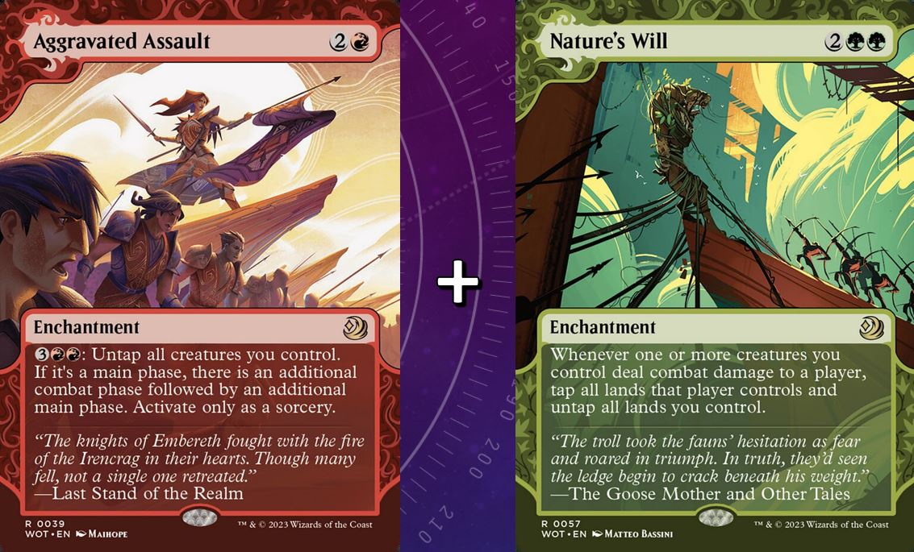

+++
title = '[Bracket 3] Bello, Bard of the Brambles'
date = 2025-09-13T00:00:00-05:00
draft = false
+++

# Decklist

https://moxfield.com/decks/GHNHsV9zLk6Ym5PbtF_p0w

Credit: [Hydrax](https://moxfield.com/users/Hydrax)

# Primer

https://moxfield.com/decks/Cj_pp4WH2EueTzNJcyOamQ/primer

# Introduction & Gameplan

Bello, Bard of the Brambles is Bloomburrow's resident magical trash panda, capable of animating and weaponizing the various trinkets that others have discarded or see no value in.

Bello has the unique ability to turn all of our 4-CMC or higher Artifacts and Equipment (that don't attach to something) into 4/4 Elemental creatures during our turn. No activation or mana required; this is a state-based static ability. This means that just Bello's presence on the field is enough, and we can simply focus on casting the best 4-CMC and higher artifacts/enchantments in Gruul colors to take advantage of not only their original text boxes, but also the fact that they are now Indestructible, Hasty, 4/4 creatures that draw us a card when they hit an opponent directly.

And because his ability applies the creature type as a static effect, it means that our enchantments ENTER the battlefield as creatures, meaning that they will trigger things like Elemental Bond and Garruk's Uprising, as well as Molten Echoes (just remember to name "Elementals" with it). It should be noted that our enchantments are not creature spells on the stack when we cast them, but they enter as creatures.

This particular build is an Enchantment-focused build, but if you're looking for a slightly weirder take on Bello, I have also put together a Vehicle list for him here. The idea is that since the Vehicles turn into creatures during our turn, we don't have to crew them. But this is my preferred build, since enchantments are a bit more robust and harder to interact with.

Make no mistake, this deck is garbage, but it's MY garbage!

## Early Game

Bello, Bard of the Brambles provides a bit of flexibility in the early game. You can turbo him out quickly and follow up with your enchantments afterward, which is completely feasible since he grants them Haste. Or you can play it a bit slower and set up enchantments in advance and play him later when you're ready to start swinging.

I actually prefer the latter, since enchantments are typically the least-interacted with permanents in the game (aside from lands), so it's unlikely many of them will get removed. This means you can safely set up two or three of them and cast Bello when you're ready to start swinging. Doing it this way gives opponents the least possible amount of time to remove him before we get some value out of his card draw ability. And the best part is we can swing without worry since he also grants our enchantments indestructible.

## Mid Game

The mid game is all about setting yourself up for reliable damage delivery. With all of your card advantage and card draw effects, look to keep any enchantments that do the following:

Evasion & Combat Superiority, examples include:

Bedlam, Gruul War Chant, Street Riot, Nylea, God of the Hunt

Anything that helps you push damage past enemy blockers

And subsequently Massive Damage Potential, examples include:

Molten Echoes, Berserkers' Onslaught, Sight of the Scalelords

Anything that puts more power on board or amplifies damage dealt by your existing resources

And finally, if there's nothing else to do, prioritize any and all lifegain effects you can find. Things like Glorious Sunrise and Leyline of Vitality. It's not much but every little bit of lifegain will help you out-grind your opponents.

## Late Game

If the game hasn't ended, look to assemble the Aggravated Assault + Nature's Will combo. But be sure to have some form of evasion such as Bedlam set up because you need to guarantee at least one of your creatures connects with an opponent to keep the combo going. With the sheer amount of card advantage this deck has at its disposal (between Bello himself and the various enchantress draw effects) it's only a matter of time before you find your combo pieces.

Otherwise, just continue to beat opponents' faces in. Show them that one raccoon's trash is greater than most nations' entire arsenals.

# Pros, Cons & Power Level

✅ Pros

* This is an aggressive Gruul deck that is way less susceptible to board wipes than most other Gruul decks, simply because Bello turns our enchantments into creatures only on our turn. On everyone else's turn, they are just enchantments, making it very difficult for opponents to actually cripple our board with a traditional wipe.
* This deck has immense card advantage, not only from its commander Bello, Bard of the Brambles, but also due to the various enchantress draw effects like Setessan Champion, etc. This means we almost never run out of gas and rebuilding after a setback is a trivial matter.

❌ Cons

* It relies heavily on its commander to apply pressure to opponents. The nice thing is that it also ramps quite quickly, so re-casting Bello after removal isn't terribly difficult.
* Gruul is pretty lacking in lifegain options (there are a few in here but not many). Bello also notably only animates our enchantments on our turn, which means we'll be mostly defenseless on opponents' turns. This means we're adopting an "all or nothing" playstyle, with the goal of beating down our opponents before they can beat us down. I don't mind this personally, as it leads to much quicker and more exciting games.

☢️ Power Level

* This deck is high power casual.
* Its primary win-con is combat damage with animated enchantments, but it can also assemble a back up combo if the game is going too long.
* Please don't ask me for a number. I don't believe that using a 1-10 scale to gage power is useful. Describing what your deck does and how it wants to win is much more meaningful.

# Packages

## Ramp (26)

* Birds of Paradise, Elvish Mystic, Fyndhorn Elves, Llanowar Elves, Sanctum Weaver, Sol Ring, Arcane Signet, Talisman of Impulse, Thought Vessel and Frontier Siege all generate mana on their own.
* Goblin Anarchomancer and Herald of the Pantheon reduce the casting cost of our spells.
* Encroaching Dragonstorm, Archdruid's Charm, Farseek, Glimpse the Core, Nature's Lore, Rampant Growth and Three Visits all get lands out of our deck and onto the field. These help thin the deck out so we're drawing more gas with our high number of card draw sources.
* Glorious Sunrise, Utopia Sprawl, Wild Growth and Fertile Ground all increase the mana generated by our lands.
* Court of Bounty lets us get an additional land into play each turn.
* Overlord of the Hauntwoods can create lands by itself.
* Nature's Will untaps our lands if we deal combat damage to an opponent.

## Removal & Interaction (15)

* Vandalblast can get rid of a single artifact or all of them if we overload it.
* Khalni Ambush, Bridgeworks Battle, Archdruid's Charm and Gimli's Reckless Might can force fights between creatures.
* Shatterskull Smashing, Overlord of the Boilerbilges and Blasphemous Act can deal burn damage to creatures.
* Archdruid's Charm and Cindervines can get rid of an artifact or enchantment.
* Beast Within can take care of any permanent.
* Boseiju, Who Endures has a Channel ability that can deal with most types of permanents.
* Heroic Intervention and Deflecting Swat can be cast in response to removal to protect our board.
* Asceticism can regenerate a creature at instant speed, saving it from destruction.

## Card Draw & Card Advantage (15)

* Bello, Bard of the Brambles is our main source of card advantage, granting our enchantments the ability to draw us a card when they connect with combat damage.
* Argothian Enchantress, Setessan Champion, Verduran Enchantress, Eidolon of Blossoms and Enchantress's Presence all draw us a card when we cast our enchantments.
* Elemental Bond, Garruk's Uprising and Guardian Project all draw us a card when we play a creature with the required properties. It should be noted that Bello's ability is a state-based effect so any enchantment we cast on our turn that meets his requirements also enters AS a creature, so it will trigger our card draw enchantments.
* Disciple of Freyalise can sacrifice another creature to draw us cards. Note that on our turn, our enchantments are 4/4 creatures with Bello on board.
* Glorious Sunrise can draw us a card with its third option.
* Chimil, the Inner Sun lets us Discover on our end step, essentially free card draw if we choose not to cast the spell we discovered.
* Court of Bounty, Court of Embereth, Court of Ire all introduce The Monarch into the game, which draws us a card on our end step if we retain the crown.

# Combos

Requirements

* Aggravated Assault and Nature's Will on the field
* At least 5 lands
* Some way to make sure at least one of your creatures can get through blockers. This could be something like Trample or an unblockable effect like Bedlam.

Steps

1. Move to combat. Attack with your creatures and make sure at least one of them deals combat damage to an opponent.
1. This triggers Nature's Will, untapping your lands.
1. Move to post-combat main phase. Activate Aggravated Assault using the mana from the lands you untapped from Nature's Will.
1. Repeat steps 1-3 as many times as needed

Notes

* Note that Bello, Bard of the Brambles grants a card draw ability to the enchantments he has animated, but that card draw ability is mandatory, so be careful that during this infinite combat combo that you don't deck yourself out.
* You need to ensure that at least one creature connects every time to be able to continue the combo, so setting up something like Bedlam or a trample effect like Nylea, God of the Hunt is recommended beforehand. Alternatively, you can wait to start this combo until an opponent is defenseless without creatures, so you can use that player as your punching bag for easy combat damage triggers.