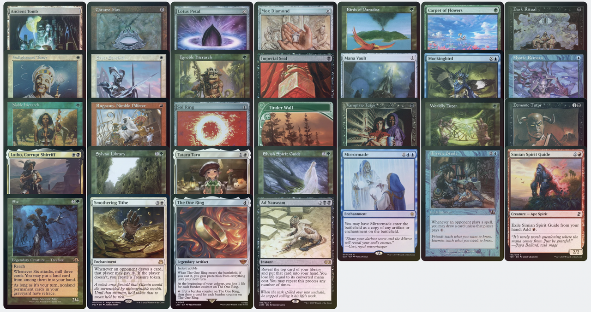
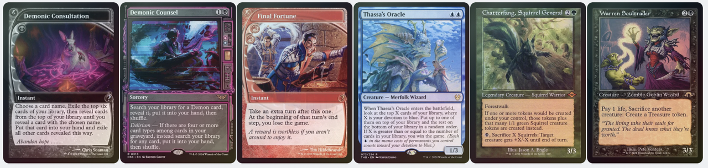
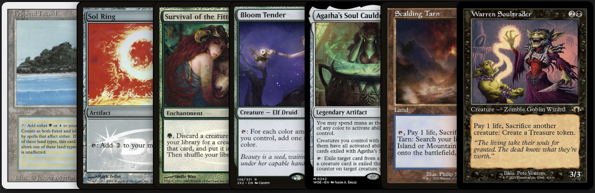
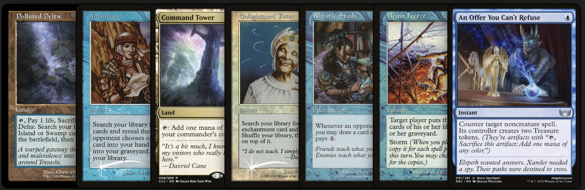
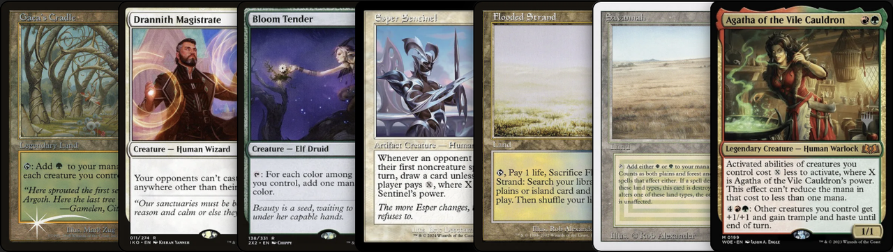
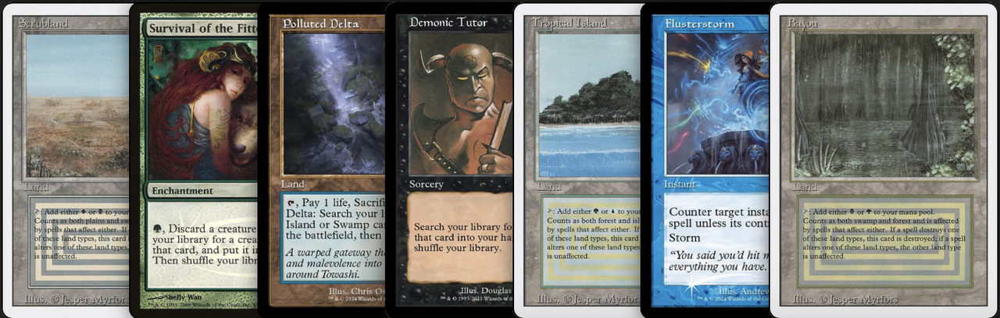
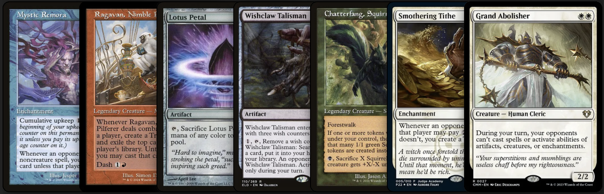
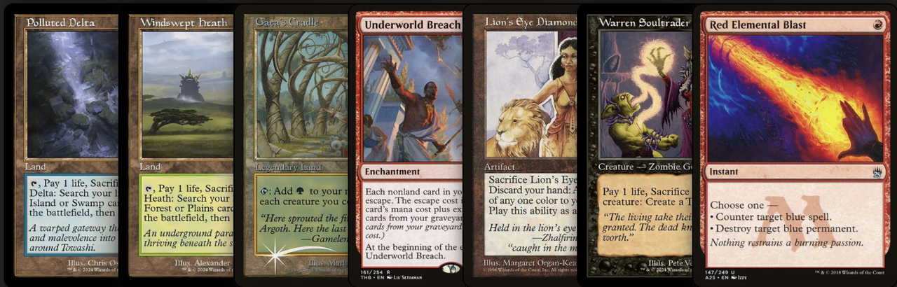

+++
title = '[Bracket 5] Kenrith, the Returned King'
date = 2025-09-13T00:00:00-05:00
draft = false
+++

# Decklist

https://moxfield.com/decks/JqHn8EOJT0yNOXMojpIeBg

Credit: [DrGiovanni](https://moxfield.com/users/DrGiovanni), [InSertS](https://moxfield.com/users/InSertS), [pradasfdez](https://moxfield.com/users/pradasfdez)

# Primer

https://moxfield.com/decks/mkIhm5thEUGpwANTr1-GJQ/primer

# Introduction

Welcome to a Turbo Kenrith, the Returned King list. This resilient, combo-based deck plays extremely high quality cards and a high density of compact one-card wincons that can threaten to end games efficiently.

This is the result of the Dockside Extortionist / Nadu, Winged Wisdom / Mana Crypt / Jeweled Lotus bans. The deck has lost its best card and combo piece, as well as a very important value engine like Nadu, Winged Wisdom. However, it is still a 5-color deck, where you can play the best cards in the format, with plenty of build options.

The deck is a trival of combos, with many synergies between cards (and I discover new lines and synergies every day) that improves with each edition that Wizards decides to release.

This list was made possible with the help of InSertS, a great Kenrith player, with whom I spend many hours a week discussing how we can improve it, with his special version of the deck, and I highly recommend you to take a look at his list.

Recently, DrGiovanni has also joined us, who has contributed his extensive experience playing cEDH and we have had long discussions with him about the deck and its purpose.

By this time the list had evolved into a deck that was more Turbo than Midrange. I started playing Turbo to move to an Evolution version, with the launch of Nadu, Winged Wisdom I played a pure Midrange version to go back to the beginning, the turbo plan.

I see this deck as a turbo deck that can capitalize on multiple win conditions. It has spells that allow you to go fast when you need to, or play it slow and gain value with the best value engines in the format. Overall, you have enough tools to navigate multiple matchups, and you can customize your deck with spells that fit your meta.

The deck also has tags that give as a general guide about how it is built.

## Why Kenrith over the other 5c Commanders or Blue Farm?

Anyone who sees the list will think, why play Kenrith, the Returned King instead of Najeela, the Blade-Blossom, Terra, Magical Adept // Esper Terra, Blue Farm...???

First, we will start with the 5-color commanders.

On the one hand, there are decks with a similar core structure, and a solid turbo plan.

However, these decks have two problems. First, everyone knows what cards they’re playing. Second, they take up slots in backup plans that don't synergize with the main plan. Najeela, the Blade-Blossom, Terra, Magical Adept... they have that problem. When they play certain cards, you know what their game plan is. Terra, Magical Adept can be harder to read, but she's so turbocharged that opponents usually try to have interaction in hand as a countermeasure.

When your opponents sit down at the table, they inmediately think about is infinite mana lines. Our game and the cards we carry won't convince them otherwise, so we remain unnoticed and unpredictable to our opponents. In addition, we only play cards that support the game plan, blue farm style. This way, we won't have dead cards in our hand or cards that only become useful under certain circumstances.

“With those commanders, you have access to Fierce Guardianship and Deflecting Swat.”

Yes, but those commanders don't help the main game plan; they only support the secondary plan, which is unrelated to the main plan. Isn’t it better to stay open and pay for that interaction directly instead of casting your commander (they usually cost 3 cmc) for a “free” counter.

Tymna the Weaver is the only commander who does not comply with the latter, and it is always a good idea to cast. So, why not play blue farm?

Blue Farm is the best deck in the format. It has the best resources in the meta, its commanders draw cards, and have access to free counters... But Kenrith has a lot to say.

Green brings many things that Blue Farm doesn't have access to:

* Dorks, stable and cheap mana sources
* Culling Ritual, a devastating card that not only allows you to clear the board, and gives you the mana to win thanks to black tutors.
* Six/Shifting Woodland, constant recursion or uncounterable
* Fast mana for post Ad Nauseam/Necropotence thanks to cards like Tinder Wall or Elvish Spirit Guide

Additionally, if we manage to prevent the creatures from connecting, they won’t have an advantage over our list.

For all these reasons, I believe Kenrith is one of the best options available in the format. He constantly change and improves with new releases, allowing him to adapt to anything.

## Pros

* The best combination of colours is to play all 5 colours, to get the best cards in the format.
* The deck can be adapted to any game situation and is super easy to pivot to other wins.
* It can be played in so many different ways that it is completely unpredictable for opponents.
* It is an ever-changing deck, so you can always add new changes based on the meta and it will always remain competitive.
* It is a lot of fun and motivation to constantly working on the list with each new release.

## Cons

* You don't have the card draw of other decks with your commander, so you rely a lot on making good mulligans to have draw engines or value engines to develop your game.
* Playing 5 colours is never easy. A bad fetch decision can cost you the game, and you can always have dead cards in your hand that you can't play.
* You will always be a threat and your opponents will play accordingly.

# Strategy

### Main Plan: Turbo Plan

The deck’s main plain is to attempt to win as early as possible. For that reason, it includes many rituals and fast mana, a large number of tutors, and several one-card wincons like Ad Nauseam, Necropotence and Intuition. If your mulligans give you a hand capable of winning on turn 1 or turn 2 win or a turn 3, go for it.

In a meta that is increasingly midrange focused, denser and more interactiva than ever, the turbo plan allows us to try to win before the table has developed sufficiently. Most players are not going to stay open mana and not play their mana dork in order to interact.

### Back-up Plan: Midrange

Mulligans and pods are not always ideal, but the deck has the resources to play and endure these games. The buckup plan is to develop the value of the deck. In Kenrith, the Returned King, the mulligans are crucial to your success.

The main idea is to quickly get a draw engine into play (Mystic Remora or Rhystic Study) and play cards that have significant impact on the table and allow you to reach victory lines (Smothering Tithe, Copy Enchantment, Ad Nauseam, Necropotence, The One Ring...).

It's important to build our board quickly. The list includes a lot of dorks, mana rocks and rituals, so mana is not a problem.

Due to the bans, the draw engines are not as effective as they used to be. Often we don’t have enough mana to win, even when we have the cards in hand. This list is designed to consistently overcome that issue.

### Delirium and Graveyard

This deck is completely focused on resolving the Underworld Breach as quickly as possible. Therefore, filling up our graveyard is an important aspect that must be constantly taken into account during the game. We also play powerful Delirium cards, such as Shifting Woodland or Demonic Counsel. That is why the deck allocates some slots to reach that starting point quickly.

Cards such as Six, Culling Ritual, Entomb, Brain Freeze and Intuition (if we have enough mana) are cards that allow us to speed up our game plan.

If we can develop our main plan and play a theft engine, early on, it will develop on its own. However, if we fail to cast those spells, the deck plays cards that allow the plan to develop consistently. Six is a card that allows us to develop this strategy and see cards every turn, giving us more options to win.

We also play cards that allow us to achieve Delirium efficiently, such as Entomb, Diabolic Intent or Culling the Weak. With Entomb, we send an Instant to the graveyard, along with the piece we need for our combos or cards, such as Esper Sentinel. With these cards, we practically have Delirium if there is a fetch in the graveyard. The same thing happens with Neoform or Diabolic Intent; we send a sorcery and a creature to the graveyard. Note that Instants and Lands are the easiest to obtain.

### Why play Turbo?

In a meta where everyone is trying to resolve their Rhystic Study and develop a valuable board, it is becoming harder to consistently win those games. The midrange has become a kind of lottery where winning depends more on luck than skills.

The deck has all the tools necessary for playing midrange and winning, but it's in the early turns where we have the most opportunities to try.

Resolving cards quickly such as Necropotence or Ad Nauseam gives us a good chance of winning. Opponents tend to be taped, there isn't much (if any) interaction, and sufficient draw engines haven't been developed.

Furthermore, Kenrith is an under-the-radar commander, so opponents won't mulligan for interaction, nor stay open on mana to interact because they won't see him coming.

# Combos and Wincons

On this section you will find an explanation of the main combo lines in the deck.

## Breach Lines

I always played Underworld Breach in all my Kenrith lists. From the more turbo versions, to the slower ones.

I think it's the best combo in the format, it synergizes very well with the deck, and the cards that make it up are never dead cards in the hand.

Underworld Breach allows us to recover any piece from the graveyard if we have enough cards on it. Brain Freeze can always be cast if enough spells have been cast during the turn and recover the pieces we need, and if they are creatures, reanimate them with Kenrith. Sevinne's Reclamation and Intuition are also useful tools…

Now that the list is more turbo, without Dockside, it has become the main line of the deck.

* Underworld Breach + Lion’s Eye Diamond + Brain Freeze

Requirements:

Mana: 2UR Reduced to just 1R if you have at least 3 other cards in the graveyard or hand.

If you have Lion’s Eye Diamond in graveyard, you need to have at least 6 other cards in graveyard.

* Underworld Breach + Lotus Petal + Brain Freeze

Requirements:

Mana: 2UR Reduced to just 1R if you have at least 6 other cards in the graveyard or hand.

If you have both pieces in the graveyard, you need to have at least 9 other cards in graveyard.

At this point, you have a lot of options. The usual one would be casting a Grand Abolisher (just to be extra safe), milling the rest of your deck, and then escaping a Thassa's Oracle from your graveyard to win the game. If you don't have access to your Thassa's Oracle, you can also continue to escape Lion's Eye Diamond and Brain Freeze to mill the entire libraries of your three opponents.

If you milled your entire deck, you can then pass turn and your opponents will lose when drawing from an empty library on their turns. Other option, you can make your opponents draw with Kenrith, the Returned King ability to make your opponents lose instantly by attempting to draw from their empty libraries.

Alternatives:

Alternatives for Brain Freeze:
The wheels (Wheel of Fortune and Windfall) are another alternative for Brain Freeze to perform the combo, since they also allow you to mill your.

However, it is way more dangerous to do it with a wheel, since you will keep giving cards to your opponents, so they can draw into interaction. It is recommended to do it this way only after resolving a Silence effect.

Alternatives for Lion's Eye Diamond:
Smothering Tithe can also work as an alternative for Lion's Eye Diamond if you are going for the Wheel of Fortune or Windfall lines. Just a wheel and Smothering Tithe is already good enough, but if you have Underworld Breach in play, you can keep going through your whole deck until you find something more relevant.

An Offer You Can't Refuse is also an alternative for Lion's Eye Diamond, and it allows you to mill your deck at instant speed, which can be useful to respond if someone tries to destroy your Underworld Breach. For this to work you need to have a bit of storm and U to cast An Offer You Can't Refuse.

The idea is that you put Brain Freeze on the stack targeting yourself, let some copies resolve (leave at least 1 copy and the original on the stack), then use your U to cast An Offer You Can't Refuse to counter the original Brain Freeze. This will give you 2 Treasures and put the original Brain Freeze back into your graveyard. Use one of those Treasures to cast An Offer You Can't Refuse again to counter a copy of Brain Freeze, which will now leave you with 3 Treasures.

## Thassa's Oracle

The main A+B combo of the format. In addition, Tainted Pact is another tutor that works well with Underworld Brech and Demonic Consultation can be a last chance tool.

Thassa's Oracle + Demonic Consultation

Thassa's Oracle + Tainted Pact

Entomb + Tainted Pact / Demonic Consultation + Kenrith, the Returned King

Be careful when executing this combo if you have Esper Sentinel in play. Their draw triggers are not optional, so if you exile your whole library with Demonic Consultation/Tainted Pact and an opponent casts one noncreature spell, you will be forced to draw from your empty library and lose the game before Thassa's Oracle ETB trigger can resolve.

If you have Kenrith, the Returned King or Shifting Woodland on the table and enough mana, with Entomb we can do the combo at instant speed.

# One Card Wincons

## Ad Nauseam

One of the most important cards in the format ever.

While the deck is not entirely focused on solving an Ad Nauseam to win, it is an important card in the list. We have a low overall CMC, we carry a lot of tutors and ramp pieces so we can resolve it quickly.

Since the bans, it is recommended to not go for it in your main phase if you just have 5 mana. If you have 2 mana extra it is generally safe to cast Ad Nauseam and flip into a winning line when resolving it.

If you want to win with Ad Nauseam, the deck is ready. The next cards generally allow us to do so:

## Necropotence

Necropotence is a powerful engine that also works as a one card wincon, especially when paired with Borne Upon a Wind, Valley Floodcaller or Final Fortune.

It takes time to get used to it and to know when to pay more life and when to be more conservative, but generally, if you have 2+ mana left after resolving Necropotence, you should pay most of your life into it. On the other hand, in the early game, when you don't have much mana available and have to tap out to play Necropotence, it is better to pay a "lower" amount of life into it, like 10 for instance. This allows you to refill your hand with good cards and discard the ones you don’t need. Then, on the next turn, when you untap with all your mana available, you can go all in and pay almost all the life you have left.

Borne Upon a Wind and Valley Floodcaller allow you to play all the cards in your hand during your endstep, so you can win with 30+ cards on instant speed before going to discard. Final Fortune allows you sculpt a perfect 7, go to your next turn, untap and win. Keep in mind that anything you discard in the clean up will be exiled, so be careful about what you discard.

When you have a Necropotence in play and more than 7 cards in hand, and you discard down to 7 cards, a separate trigger is created for each of the discarded cards to be exiled from the graveyard/. Each trigger generates a round of priority, and the good thing about having priority during the cleanup step is that effects that last "until end of turn" or during "this turn" have already ended. So if you were silenced by Silence, or by someone sacrificing a Ranger-Captain of Eos, or if you couldn't win due to an Angel's Grace, all those effects will be gone (keep in mind that if you cast Borne Upon a Wind during the turn, that effect will also be gone during the cleanup step). After discarding down to 7 cards, you can cast Borne Upon a Wind, Valley Floodcaller or Final Fortune and proceed to win the game.

This deck consistently resolves Necropotence on T2 (T1: Land + Dork; T2: Land + Necropotence) and, by playing mana dorks, we generate mana consistently and reliably to increase our chances of winning.

If we decide to pay a low amount of life, and we have cast the card from dorks, we can easily have 5 or 6 mana sources it is easy to have 5 or 6 mana sources on our next turn to try to win.

## Intuition

Thanks to Sevinne's Reclamation, Intuition is a card that allows you to build the entire Underworld Breach combo all by itself.

It has a couple of pre-requisites:

You need to have 6 available mana (2U + 2W/R) if you are doing it on your turn, or 3 (2U) in someone else’s turn + 3 on your turn ((two of them need to be WR).

You also need to have at least 2 cards in your graveyard and 6 more cards between your hand and your graveyard (not counting Intuition)

Steps:

1. Cast Intuition targeting an opponent (preferably someone without green to dodge Veil of Summer)
2. Choose Underworld Breach, Lion’s Eye Diamond and Sevinne’s Reclamation.

If they give you Underworld Breach or Sevinne’s Reclamation:

Cast Underworld Breach, or Sevinne’s Reclamation to put Underworld Breach in play.
Escape Lion’s Eye Diamond from your graveyard (exiling any 3 cards that are not Intuition).
Sacrifice Lion’s Eye Diamond for UUU and discard your hand.
Escape Intuition by using 2U, and choose Brain Freeze and two more cards that you don't mind exiling.
Escape Lion’s Eye Diamond again, exiling any 3 cards that are not Brain Freeze.
Sacrifice Lion’s Eye Diamond for UUU.
Pay 1U to escape Brain Freeze by exiling the rest of the cards that are not Lion's Eye Diamond (you can exile Intuition now) and start the loop of casting Lion's Eye Diamond and Brain Freeze to win.

If they give you Lion’s Eye Diamond:

3. Cast Lion’s Eye Diamond and sacrifice it for WWW, discarding your hand.
4. Cast Sevinne’s Reclamation with flashback from the graveyard, targeting Underworld Breach. When it resolves, target Lion’s Eye Diamond with the copy.
5. Continue from the step 4 in the above line.

## Underwold Breach + Hand tutor

(With enough graveyard and mana)

If you have a tutor or a relevant card in the graveyard, Underworld Breach can work as a one card wincon. Any to-hand tutor like Gamble, Demonic Tutor, Diabolic Intent or even Tainted Pact (or Demonic Consultation on more desperate situations) can also work as a one card wincon. With enough resources (mana/cards in graveyard to pay escape costs), you can tutor the Underworld Breach, play it, escape the tutor to get the Lion's Eye Diamond or Brain Freeze, and repeat for the other piece.

# Single Card Discussion

## Interaction

The deck plays the best counters in the format:

Stack interaction

* An Offer You Can't Refuse
Unconditional noncreature counter that also helps with Underworld Breach combo lines and can be used as a ritual to generate positive mana.

* Flusterstorm
Strong instant & sorcery counter when the storm is high enough.

* Force of Negation
Noncreature counter that works best when it's not your turn, since it becomes free.

* Force of Will
Unconditional counter that is able to be casted for free by exiling a blue card from your hand, which the deck has in abundance.

* Mental Misstep
Free counterspell that can be used to protect your spells/board, hit early advantage pieces like Mystic Remora or midgame 1 cmc tutors to disrupt your opponent's game plans.

* Pact of Negation
Free unconditional counter, with a big drawback of having to pay on your next turn. It is best used to protect your win attempt and can be recurred from the graveyard with Underworld Breach.

* Swan Song
Unconditional counter for the most relevant noncreature types of spells.

* Mindbreak Trap
It is a great interaction piece, but it has a very big downside: it doesn't work when trying to protect your win attempt. Despite that, with a meta dominated by Blue Farm and Rogsi, it's a great interaction card for those first few turns or when you're going for the win.

* Silence
Amazing and unique effect that can be used to stop an opponent or to prevent opponents from interacting when you are trying to win.

* Red Elemental Blast
Unconditional counter for the most relevant blue spells.

Board interaction

Overall, the deck has very few “removals”. Our game plan isn’t to control the table, but rather, it has the necessary resources and strategies to minimize the impact of stax. It is also important to note that the list includes 10 tutors that can search for any card in the deck. If we need to remove a card, we can always search for it.

Cards that affect nonland permanents:

* Boseiju, Who Endures
The other great land with channel ability. It allows you to remove that piece of stax that bothers so much to win (like Blind Obedience) or to stop your opponents with many of the most common lines (Breach, Basalt Monolith, some lines of Displacer Kitten...).

* Into the Flood Maw
Instant speed nonland bounce for opponents at the cost of just .

* Snapback
Free Instant speed bounce for creatures. This is specially good with Ad Nauseam or Necropotence thanks to An Offer You Can Refuse.

* Chain of Vapor
Instant speed bounce. Specially good after Ad Nauseam

* Red Elemental Blast
Unconditional removal for the most relevant blue spells.

Board Control

In addition to all the interaction pieces described above, the deck plays a few creatures that allow it to control the table.

* Culling Ritual
Massive removal, giving us back mana to develop our turn.

## Lands

Inclusions

I have seen very few primers that talk about the number of lands they carry and why.

It has been proven that in a 5 color midgame deck, it is best to carry 28-29 lands.

In our case, we carry a lot of ramp pieces and dorks, so I think 28 is the best option. If you want to try a more turbo plan, 27 lands is also a good option.

The deck plays:

The best lands that give of all colors:

* City of Brass
* Command Tower
* Exotic Orchard
* Mana Confluence
* Tarnished Citadel

The Kamigawa lands that we think interact best and give us the best colors of the deck (Boseiju, Who Endures and Otawara, Soaring City).

The two lands that can allow us to speed up our game ( Ancient Tomb, Gemstone Caverns ).

We also play two lands that are very useful and facilitate our victories:

The Cavern of Souls lets us resolve our silence effects in a counter way. Additionally, naming humans provides us with early casting options, such as Esper Sentinel, Noble Hierarch, and Kinnan, Bonder Prodigy.

Likewise, the Shifting Woodlans enable us to safely resolve our silence effects or our Underworld Breach if they are in the graveyard.

All the duals, except the worst according to the colors that the deck plays ( Plateau ), and the rest are the fetches. There are two that we do not play for the same reason as the dual, they give us the worst colors of the deck and are not necessary (Arid Mesa and Wooded Foothills).

Exclusions

Apart from the above described, the deck could carry other lands, but I consider that they are either not a good option or are not necessary.

City of Traitors

Just like the cavern, it only gives us colorless. It is a good ramp piece, but it is very instant and useless without mana stones in hand.

Talon Gates of Madara

Same as the previous ones, but this seems like a more viable option to me. Paying one to have any color is fine, but we need to develop well in the Early going and that mana can be very necessary. It can also be used as removal, but having three blocked lands in hand for removal doesn't seem like a good idea to me.

## Relevant Inclusions

* Six
Six has been a great discovery. It does everything the deck needs.

Six is a powerful card after Ad Nauseam. It allows us to retrieve our graveyard permanents (Lotus Petal l is the best target) and on our winning turn, we can attempt it multiple times if we are stopped.

It also fills up our graveyard, which is very useful for Delirium and Underworld Breach. And we will almost always get a land back, so we won't get stalled or be forced to play a permanent from the graveyard.

Cards like Entomb or Brain Freeze work very well with them. If you have lands in hand, victory is practically yours.

* Copy Enchantment
This time, DrGiovanni recommended it to me.

In the first few turns, everyone is looking to cast their draw engines or Smothering Tithe. Mulligans are not always the best, but adding adding a card like Copy Enchantment, makes them much better. There are always good targets (Mystic Remora, Rhystic Study, Smothering Tithe...).

In the current meta, having draw engines is vital, so in a deck like Kenrith’s, which has no draw from the command zone, the Copy Enchantment gains a lot of value. It is also a blue card, so we won’t be affected when we pitch with the Force of Will or the Force of Negation.

There are other options in the meta, such as Steal Enchantment and Mirrormade. Mirrormade extra blue pip it's a downside in early and it isn’t as risky as Steal Enchantment.

* Demonic Counsel
Another recommendation from DrGiovanni

Since this is an Underworld Breach list, why wouldn’t we want another Demonic Tutor? It is easy to get Delirium by turn 3/4, and it gets better as the game progresses. Since the deck works with the graveyard, and generates a lot of mana, it almost always turns into a One Card combo.

Although it is a dead card in the initial hand, we can develop our dorks and value engines and cast it when we see an opportunity to win. A third hand tutor gives us many wins with the Borne Upon a Wind.

One of the best cards in the deck is Culling Ritual, and it’s always necessary to have an outlet for all that mana. The Culling Ritual and the Demonic Counsel synergize very well because they put us directly in the graveyard with sorceries, creatures and artifacts.

* Mockingbird
The deck has always had a high density of clones. With the current meta shift, we see a lot of Tymna the Weaver / Thrasios, Triton Hero, Kinnan, Bonder Prodigy or Magda, Brazen Outlaw decks, so clones are still important.

Right now, without a clear target that allows you to win immediately, the mockingbird has become a very good value piece.

With it, you can copy a lot of the low-cost creatures that provide value.

In addition, the Mockingbird is searchable with the Ranger-Captain of Eos.

* Culling Ritual
After Dockside's ban, rival decks no longer feel punished for playing as many mana rocks as possible. Cards like Smothering Tithe have also benefited greatly from this.

Culling Ritual allows us to wipe practically the entire table while gaining an advantage from doing so. It also works very well with Mnemonic Betrayal as well, allowing us to play everything that has been destroyed and try to win.

The deck plays a high density of green and black tutors, in addition to being able to reanimate everything we need with Kenrith, so if we manage to solve a Culling Ritual, it is very possible that we can also win or take advantage of it.

* Tinder Wall
After developing the list into a turbo plan with back-up creature combos, I decided to add Tinder Wall to the list.

It is a very easy card to cast, it improves our mulligans and it gives us a ramp point that can help us to have an advantage over the rest of the table. In addition, it make our Ad Nauseam much better with Elvish Spirit Guide, and it can be searched with Ranger-Captain of Eos.

Also, if you decide to play Wheel of Fortune it can allow you to combo with Underworld Breach.

* Final Fortune
This is not a full turbo list, and it does not play cards like Necropotence, but it does have a game development that allows us to take advantage of an extra turn at very specific times. With all the draw engines that the deck has, all the value, and all the mana it generates, there are many games that we don't win because we don't get the turn, won by other players due to lack of interaction at the table. Final Fortune allows us to win when we otherwise would not, and gives us an advantage that no other deck slot gives us. All the effects that can change the turn order are absolutely insane.

* Imperial Seal
After denying it for a long time, I decided to add it. It fixes a lot of mulligans, which are very important to win with this deck. Although this deck does not generate as much card draw as Blue Farm, the deck needs a high tutors density, so it is necessary to include a tutor that allows us to search for any card in the deck.

In addition, We also play a lot of creatures, so the rival Ragavan, Nimble Pilferer is not a problem, and it works very well with Borne Upon a Wind.

* Kinnan, Bonder Prodigy
The deck plays: 5 dorks, 7 mana rocks and 5 treasure makers. With all those cards, there's no reason to not play Kinnan, Bonder Prodigy.

It can also be used to open combo lines together with Warren Soultrader, as described above, and it allows us, when we try to combo with Underworld Breach + An Offer You Can Reffuse, to reduce the number of casts or pay the Rhystic Study tax in play.

* Entomb
Why play Entomb without playing Reanimate or any creature with a high CMC?

Entomb is a card that works very well in this list with Underworld Breach, Sevinne’s Reclamation, Six, Shifting Woodland… You can send any card you need to the graveyard and return it with these cards.

It also allows us to obtain Delirium with only one card because we can use Entomb on Esper Sentinel or Enduring Vitality. Together with a land, these cards give us the following numbers: Additionally, it allows you to bypass Boseiju, Who Endures in the Underworld Breach lines thanks to Dark Ritual and Sevinne's Reclamation. It also enables us to use Thassa's Oracle lines at instant speed if we have enough mana and Kenrith, the Returned King on the table.

* Sumoner’s Pact
It is vital to have mana available in order to try to win, whether it is Post Ad Nauseam or Post Necropotence.

Summoner's Pact allows you, at instant speed and for 0 mana (and cmc 0), to search for creatures such as Tinder Wall or Elvish Spirit Guide that can give you just enough mana to help you to win.

It also searches for very important cards such as Six or Kinnan, Bonder Prodigy. It has a particular synergy with Kinnan because, as a Simic, we can search for it at instant speed if we don't have a blue card in hand for the fow or fon, our particular second Pact of Negation.

Ultimately, it's a free card that can help us with our Underworld Breach combos when we have An Offer You Can Refuse.

# Mulligan Guide

## Good cards in mulligans

## Bad cards in mulligans

## Depends on the rest of the cards

assets\Captura-de-pantalla-2025-07-13-a-las-21-12-46.png

## Good hands

* T1: Land + Sol Ring + Agatha's Soul Cauldron
* T2: Land + Survival of the Fittest + Bloom Tender
* T3: Win Attempt

* T1: Land + Enlightened Tutor to Sol Ring
* T2: Rhystic Study
* T3: Win Attempt

* T1: Land + Esper Sentinel
* T2: Land + Drannith Magistrate / Bloom Tender. Depending on the pod.
* T3: Gaea's Cradle + Drannith Magistrate / Bloom Tender / Kenrith, the Returned King

## Bad Hands

Mana, 2 tutor pieces in hand, but nothing to do. Very slow hand, without interaction or value pieces.

The whole hand depends on the Mystic Remora's draws, Ragavan's treasures or top deck.

Without tutors, the hand hasn't game plan and you rely only of the top deck.

# Various little tricks

* When should I cast Kenrith, the Returned King?
The list is designed to be completely independent of the commander. We don't play cards such as Fierce Guardianship or Deflecting Swat and nor infinite mana combos (the reasons for this are explained at the beginning of the primer).

Nevertheless, there are situations in which casting it may be interesting.

One example is, when we have a board full of mana, with cards such as Smothering Tithe or Lotho, Corrupt Shirriff along with Kinnan, Bonder Prodigy the game changes significantly.

The Cabbage Merchant realease also significantly changes the course of games.

The Cabbage Merchant enables us to make aggressive mulligans with only cabbage t1. The combination of The Cabbage Merchant + Kenrith, the Returned King is devastating and allows us to reap the benefits of all the mana it generates.

Also, depending on the hand and available mana, casting Kenrith, the Returned King is always an option.

Kenrith, the Returned King allows us to do everything, and it is all useful for the game, though expensive. We can gain life in the mid/late game if we have Ad Nauseam or Necropotence. We can reanimate Grand Abolisher or Thassa's Oracle after playing Entomb...

In short, Kenrith, the Returned King is the payoff for those games where we only have mana.

* Entomb, the late game card.
Yes, it's one of the most useful and versatile cards in the deck.

It helps the Underworld Breach lines send what we need to the graveyard, and allows us to use little tricks that make all the difference.

In Underworld Breach combos, if we have a Dark Ritual in our graveyard, we can bypass Boseiju, Who Endures. We can do this by sending Sevinne's Reclamation to the graveyard. Then, we can use the land we searched for to recast Underworld Breach. With one blue mana available, we can also bypass any counters or Endurance thanks to Borne Upon a Wind or Valley Floodcaller.

Another trick is to send the type of card we need to activate Delirium to the graveyard and then use Demonic Counsel or Shifting Woodland. If we send Esper Sentinel, along with Entomb if we have a land, it's automated.

We can win directly with Shifting Woodland by sending Underworld Breach or Necropotence and copying it. Remember Shifting Woodland ceases to be a copy at the end of the turn, so don’t discard it or exile it. With Six, we can accomplish something similar for fewer mana, but it can be countered.

We don't need to send a wincon to the graveyard, either. We can use a Silence effect for protection during our turn. There are several possibilities.

* Ad Nauseam in an opponent’s End Step or in your Main Phase?
Like everything in life, it depends. With Dockside banned, Ad Nauseam in main phase is more harder to be solved since we don't have that extra mana contribution from the pirate.

However, there are times when we have the opportunity to cast Ad Nauseam in our main phase and end up winning.

The most important thing to consider is the amount of mana available. If we have two or more mana left after casting, it can be a viable option. With two mana we can easily solve our Underworld Breach or cast other mana sources like Sol Ring, Mana Vaul, Carpet of Flowers... which will allow us to win the game in the end.

Another important thing to consider is what kind of mana sources are available. If we have our table full of mana rocks, it can be a very bad idea to start in our main phase because we will have no mana sources to develop our game after Ad Nauseam. On the other hand, if the mana sources are dorks, then it is easier for us to cast multiple mana rocks that we get from the Ad Nauseam.

There are also cards that make life easier after Ad Nauseam, such as Final Fortune or Chain of Vapor, which allow us to reset our board or try to generate an extra turn with the filtered hand.

In conclusion, the deck is ready to cast Ad Nauseam in our main phase, but it will always depend on our board and what mana sources we use to cast it.

* OMG Brain Freeze
Since the deck plays Six or Shifting Woodland, Brain Freeze is more than just a combo card.

With enough spells are cast in a turn, Brain Freeze can become a one-card combo played at instant speed. With the card quality of the deck, being able to send 15/18 cards to the graveyard, can practically guarantee victory.

It can also be useful if we have the Underworld Breach combo in hand and need to fill up the graveyard. Or if we need to activate Delirium for Demonic Counsel or Shifting Woodland.

Generally speaking, this card allows us to speed up the main strategies of the deck.

* Mockingbird best targets
One of the cards I get the most questions about is the Mockingbird. It does not seem to add much to the deck, since there is no target that allows us to win directly enough to spend a slot on it.

It is much more stable than other clones like Flesh Duplicate or Phantasmal Image. In most cases, it ends up costing the same amount of mana.

The Mockingbird is not on the list to win, but to provide value depending on the opponents. There are many targets in the format that help the development of the game.

Before talking about the main targets of the 99, I would like to mention which are the most played decks of the format:

Tymna Deck’s (Blue Farm / T&T / Malcom Tymna)
Kinnan, Bonder Prodigy
Thrasios Deck’s ( T&T / Rog Thrasios / Krark Thrasios / Tevesh Thrasios )
Magda, Brazen Outlaw
Derevi, Empyrial Tactician
Malcom Decks (Esper / Temur / Grixis)
All of these decks have commanders that Mockingbird can copy perfectly, the best ones are Tymna, the Weaver and Kinnan, Bonder Prodigy.

However, there are some good targets among the most played cards in the format:

Dorks CMC 1 ( Birds of Paradise …)
Esper Sentinel
Draw Engines (Archivist of Oghma / Faerie Mastermind /
Silence effects ( Grand Abolisher / Ranger-Captain of Eos / Voice of Victory)
Depending on the development of the game, we can try to copy what we need to move forward in our game plan, with Draw Engines usually being the preferred option.

* Final Fortune
One of the best resources in the format, and I don't understand why it is not played in more decks outside of turbo.

Yes, it can be a risky option, but now let's detail some examples of use that the game can give us.

The most obvious time to use it is after Ad Nauseam. We usually leave red mana untapped to cast our Underworld Breach, but it doesn't always work out the way we want or we don't have enough resources. Final Fortune allows us to generate a new turn, with the hand filtered and with all available mana to try to win.

Another example of use is when we have a silence effect in hand, a tutor or a winning piece, but we don't have enough mana to try it. In this case we can cast our Grand Abolisher/Voice of Victory, then cast Final Fortune and set ourselves up for the next turn with protection.

It is also an excellent solution to an opponent’s Silence if we don’t have any interaction on hand.

It also allows us to sneak into the turn after another player has tried to win and the opponents have spent all their interaction.

How many times have we said/heard: If it had been my turn, I would have won?? This does not happen with Final Fortune in hand. However, in order to do this efficiently, it is necessary to know how to read the state of the table very well to know when it is convenient to stay open of mana for this possibility.

It is also a good tool in tournaments to gain extra points, especially when the game comes down to the last turn. The Final Fortune allows us to try to stay on the last turn, either to try to win or to try to prevent the next player in the turn order from winning.

One of the latest use cases, that I really like, is with The One Ring on the table and 4 or 5 burden counters on it. The deck has enough card quality to be able to find enough tools to win on 5 or 6 cards that we draw. If we see that it is possible that our next turn will not come, we can cast Final Fortune and try to win in our next turn with The One Ring draws. Remember that if we have enough cards in the graveyard (3) and a tutor on hand, we can win with Underworld Brech.

The last use case is when politics are involved in the game. It is possible that in a rival’s attempt to win, we have to politicize so that another rival spends his interaction. If we have Final Fortune in hand we can always promise that we will not win in our next turn (for this Final Fortune gives us an extra turn, you have to read the fine print ajajaj). This will not work with experienced players, but it is a resource that is available.

# How to become more Midrange

Kenrith, the Returned King is one of the most alternative deck building lists in the meta. So, in the following section, we will explain how to modify the deck to create a more midrange version.

Unlike many other Kernith Midrange lists that are played, I don't think this one needs many creature combo lines. The combos of Selvala, Heart of the Wilds, Derevi, Empyrial Tactician or Cloud of Faeries are very suboptimal. They require a lot of mana, set up and resources. These combos are slow and predictable.

If we are not going to win, these cards don’t generate much value, because they require other expensive mana pieces (such as Kenrith) and don’t allow you to adapt tot he game or change your games suddenly. They also don't allow an all in strategy because you need many other cards to win (such as Gaea's Cradle, Warren Soultrader, Kenrith, the Returned King, Emiel the Blessed...).

I think a more midrange list should carry more valuable pieces to give us more resources for winning. Despite that, adding a combo like Chatter/Warren may be a good idea.

Here is a series of value engines that we can put in the deck. These engines will always be useful and will never be a burden.

### Draw Engines

More draws means more resources, so if we are going to go to the Midrange, we need as many as possible. Here are the most optimal stealing engines that our list lacks:

* Archivist of Oghma
* Faerie Mastermind
* Pollywog Prodigy
* Mirrormade
* Steal Enchantment

### Stax Pieces

Since we always go to the Midrange, we need to make sure that our opponents don’t win. Therefore, pieces that make it difficult to play and that don’t affect us are also valuable.

* Dauthi Voidwalker
* Drannith Magistrate
* Opposition Agent

### Interaction and removal

Along the lines of the previous point, adding more interaction help us either prevent our rivals from winning or protect our victories.

* March of Swirling Mist
* Delay
* Mana Drain
* Gilded Drake
* Swords to Plowshares
* Abrupt Decay
* Cyclonic Rift

### Other Pieces

Finally, there are pieces that are useful for a Midrange plan and that generate new combos in the deck.

* Bloom Tender / Faeburrow Elder
* Rev, Tithe Extractor
* Finale of Devastation / Nature's Rhythm / Eldritch Evolution
* Mnemonic Betrayal
* Gifts Ungiven
* Agatha's Soul Cauldron
* Delighted Halfling + Teferi, Time Raveler / Kutzil, Malamet Exemplar

I think that depending on the meta, our playstyle and what we think the need most, we add one or more pieces of each type listed above.

### Slots

The main slots are designed for a turbo deck plan, though many of them can also be used with a midrange plan.

* Tinder Wall
* Elvish Spirit Guide
* Simian Spirit Guide
* Wheel of Fortune
* Noxious Revival
* Final Fortune
* Mox Opal….

For me, Ad Nauseam is an autoinclude card for any black-colored deck. For 5 mana, at instant speed, it fills our hand and we don't need to go all in. It seems like a better alternative than other cards, such as Seedborn Muse (5 mana + 5 Kenrith + Set Up) or Zirda, the Dawnwaker (3 mana + 5 Kenrith + Set Up).